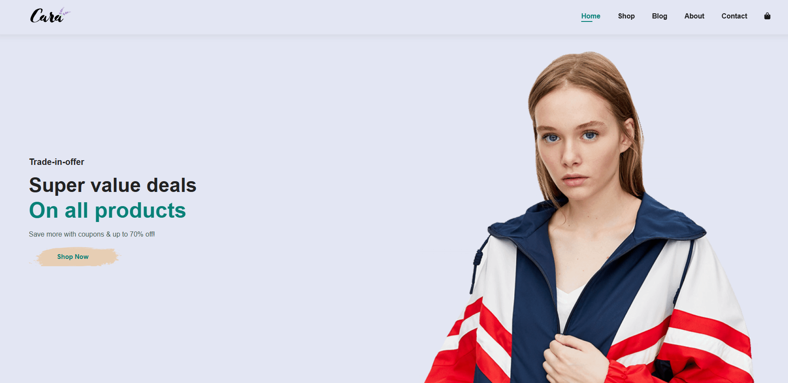

# 🛒 전자상거래 프로젝트

[🇬🇧 English README](./README.md)

이 프로젝트는 **HTML**, **CSS**, **바닐라 JavaScript**로 제작된 완전 반응형 **전자상거래 웹사이트**입니다.  
사용자가 상품을 둘러보고, 장바구니에 담고, 프론트엔드에서 주문을 관리할 수 있는 현대적인 온라인 쇼핑 경험을 시뮬레이션합니다.

---

## 🛠️ 사용 기술

- 🌐 HTML5
- 🎨 CSS3 (Flexbox/Grid를 활용한 반응형 디자인)
- ⚙️ JavaScript (바닐라 JS, DOM 조작)

---

## ✅ 주요 기능

- 📱 완전 반응형 레이아웃 (모바일 + 데스크톱)
- 🖼️ 이미지, 이름, 가격이 포함된 동적 상품 목록
- ➕ 장바구니에 상품 추가
- ❌ 장바구니에서 상품 제거
- 🧾 실시간 장바구니 총액 계산
- 📦 주문/결제 버튼 (프론트엔드 전용)

---

## 📸 미리보기



---

## 📁 프로젝트 구조

```
E-Commerce-Project/
├── img             # 프로젝트 이미지
├── about.html      # 소개 페이지
├── blog.html       # 블로그 페이지
├── cart.html       # 장바구니 페이지
├── contact.html    # 연락처 페이지
├── index.html      # 메인 페이지
├── README.md       # 프로젝트 설명
├── script.js       # 주요 기능 스크립트
├── shop.html       # 쇼핑 페이지
├── sproduct.html   # 상품 상세 페이지
└── style.css       # UI 스타일
```

---

## 🚀 라이브 데모

👉 [웹사이트 보기](https://devfayzullo.github.io/E-Commerce-Project/)

---

## 👤 제작자

📌 **DevFayzullo** 제작

---

## 📄 라이선스

이 프로젝트는 교육 및 포트폴리오 목적으로 제작되었습니다.  
상업적으로 사용 또는 수정하려면 제작자에게 문의하세요.

---

코딩을 즐기세요! 🚀
